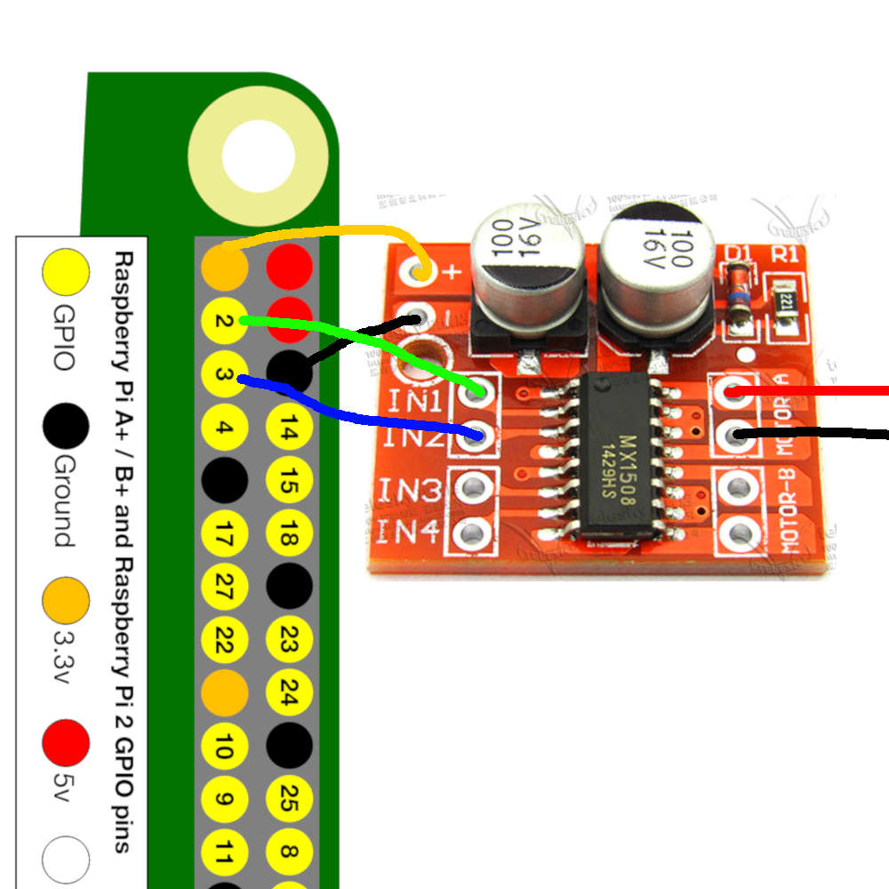

<h1 align="center">
  
  <br>A.R.G.U.S.<br>
</h1>

A.R.G.U.S.
=====

> auxiliary reliable guardian undertaking system
>
> 辅助的可靠的守护者任务系统

[](https://travis-ci.org/JRT-FOREVER/argus)

* * *

use raspberry PI as base build wifi opendoor system

#### For archlinux
AUR https://aur.archlinux.org/argus.git


## RUN dependence

**Need python 3.x**

```shell
apt install python3-bottle

Or

pip3 install -r requirements.txt --user
```

## install
```
cd argus

cp config-dist.py config.py

./argus.py
```

## test

```shell
curl -X POST -F username=test -F password=test http://localhost:8080/action/run
```
#### About raspbian gpio
**Need in group gpio or root run**

Default pi on gpio Group


#### About hardware


- You need rasperry PI

- driver
https://detail.tmall.com/item.htm?id=527306863255&spm=a1z09.2.0.0.735a2e8dUUCZCD&_u=e1nuof5e644f


- motor
https://detail.tmall.com/item.htm?id=42895138394&spm=a1z09.2.0.0.67002e8d7vkqM0&_u=e1nuof5ec235





